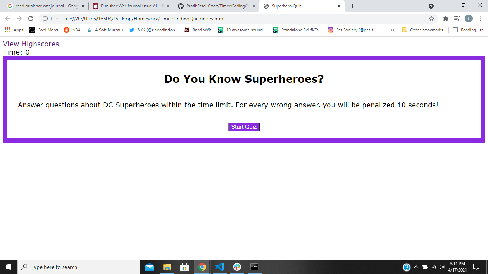
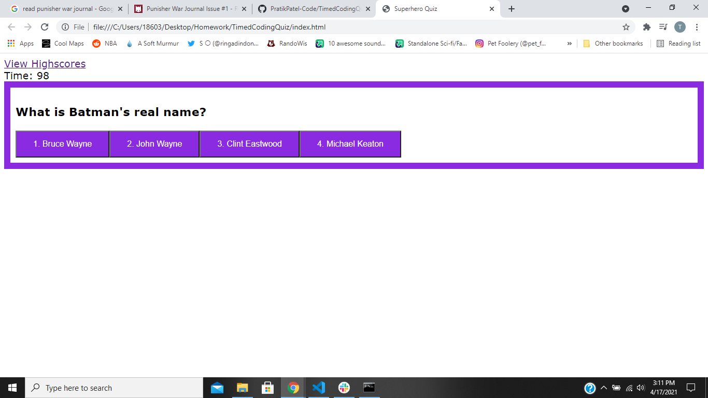

# TimedCodingQuiz
A timed quiz on DC Universe knowledge!

https://pratikpatel-code.github.io/TimedCodingQuiz/

#
## Project Overview:
A fun little quiz about the DC Universe.  It is a timed quiz, with penalties for incorrect answers.

#
## Project Goals:
1. Taking a code quiz when I click the start button
2. A timer starts and I am presented with a question
3. When I answer a question then I am presented with another question
4. When I answer a question incorrectly then time is subtracted from the clock
5. When all questions are answered or the timer reaches 0, game has ended.
6. Whn the game is over, I can save my initials and my score

#

#

## Conributers
[Pratik Patel](https://github.com/PratikPatel-Code/)

#
## Built With:
[Visual Studio](https://visualstudio.microsoft.com/)

[CSS](https://www.w3.org/TR/CSS/#css)

[JavaScript](https://www.javascript.com/)

#
## Links:
[Email](pratikpatel_85@yahoo.com)

[Github Profile](https://github.com/PratikPatel-Code/)

[DC Universe Quiz](https://pratikpatel-code.github.io/TimedCodingQuiz/)